# Database Schema

PostgreSQL schema for the CakeDay platform, managed through Drizzle ORM. Source of truth: [`src/lib/db/schema/tables.ts`](../../src/lib/db/schema/tables.ts).

Tables are grouped by domain. The ER diagram below shows the principal foreign-key relationships; attribute lists are trimmed to essential columns. Enums, timestamps (`created_at`, `updated_at`), and bookkeeping fields are omitted from the diagram for readability — see the schema file for the full definition.

---

## Domain Map

| Domain | Tables |
|---|---|
| **Identity** | `users` |
| **Companies** | `companies`, `contacts`, `addresses`, `company_settings` |
| **Subscription** | `subscription_plans` |
| **Bakeries** | `bakeries`, `bakery_districts`, `districts` |
| **Cake Catalogue** | `cake_types`, `cake_prices`, `price_change_requests` |
| **HR Integration** | `hr_integrations`, `hr_sync_logs` |
| **Employees** | `employees` |
| **Ordering** | `ordering_rules`, `orders`, `order_status_history` |
| **Billing** | `invoices`, `invoice_line_items`, `payments` |
| **Notifications** | `notification_templates`, `notification_log`, `notification_preferences` |
| **System / Audit** | `system_settings`, `public_holidays`, `audit_log` |

---

## Entity-Relationship Diagram

```mermaid
erDiagram
    %% ─── Identity ─────────────────────────────────────────────
    users {
        uuid id PK
        text full_name
        varchar phone
        user_role role
        bool onboarding_completed
    }

    %% ─── Subscription ─────────────────────────────────────────
    subscription_plans {
        uuid id PK
        varchar name
        varchar slug UK
        numeric price_monthly_try
        numeric price_annual_try
        int employee_limit
        numeric commission_rate
    }

    %% ─── Companies ────────────────────────────────────────────
    companies {
        uuid id PK
        uuid user_id FK "→ users (owner, unique)"
        uuid subscription_plan_id FK "→ subscription_plans"
        varchar name
        varchar vkn UK
        company_status status
    }
    contacts {
        uuid id PK
        uuid company_id FK
        varchar name
        varchar email
    }
    addresses {
        uuid id PK
        uuid company_id FK
        text address
        district district
    }
    company_settings {
        uuid company_id PK "FK → companies"
        bool notify_order_events_email
        smallint birthday_reminder_days
        smallint cancellation_cutoff_hours
    }

    %% ─── Bakeries ─────────────────────────────────────────────
    districts {
        uuid id PK
        varchar name UK
        district slug UK
    }
    bakeries {
        uuid id PK
        uuid user_id FK "→ users (owner, unique)"
        varchar name
        varchar slug UK
        varchar contact_email UK
        bakery_status status
    }
    bakery_districts {
        uuid bakery_id PK "FK → bakeries"
        district district PK
        smallint max_orders_per_day
    }

    %% ─── Cake Catalogue ───────────────────────────────────────
    cake_types {
        uuid id PK
        varchar name
        varchar slug UK
        bool is_active
    }
    cake_prices {
        uuid id PK
        uuid cake_type_id FK
        cake_size size
        numeric price_try
        date valid_from
        date valid_until
    }
    price_change_requests {
        uuid id PK
        uuid bakery_id FK
        uuid cake_type_id FK
        uuid reviewed_by FK "→ users"
        cake_size size
        numeric requested_price_try
        price_request_status status
    }

    %% ─── HR Integrations ──────────────────────────────────────
    hr_integrations {
        uuid id PK
        uuid company_id FK
        integration_type integration_type
        text encrypted_api_key
        bool is_active
    }
    hr_sync_logs {
        uuid id PK
        uuid integration_id FK
        uuid triggered_by FK "→ users"
        varchar status
        int records_fetched
    }

    %% ─── Employees ────────────────────────────────────────────
    employees {
        uuid id PK
        uuid company_id FK
        uuid hr_integration_id FK
        uuid preferred_cake_type_id FK "→ cake_types"
        uuid deactivated_by FK "→ users"
        date date_of_birth
        employee_source source
        employee_status status
    }

    %% ─── Ordering ─────────────────────────────────────────────
    ordering_rules {
        uuid id PK
        uuid company_id FK
        uuid default_cake_type_id FK "→ cake_types"
        uuid created_by FK "→ users"
        rule_type rule_type
        cake_size default_cake_size
    }
    orders {
        uuid id PK
        uuid company_id FK
        uuid employee_id FK
        uuid rule_id FK "→ ordering_rules"
        uuid cake_type_id FK
        uuid bakery_id FK
        uuid payment_id FK
        uuid approved_by FK "→ users"
        uuid cancelled_by FK "→ users"
        order_type order_type
        order_status status
        date delivery_date
        numeric order_total_try
    }
    order_status_history {
        uuid id PK
        uuid order_id FK
        uuid changed_by FK "→ users"
        order_status from_status
        order_status to_status
    }

    %% ─── Billing ──────────────────────────────────────────────
    invoices {
        uuid id PK
        uuid company_id FK
        varchar invoice_number UK
        date period_start
        date period_end
        numeric total_try
        payment_status status
    }
    invoice_line_items {
        uuid id PK
        uuid invoice_id FK
        uuid order_id FK
        numeric total_try
    }
    payments {
        uuid id PK
        uuid company_id FK
        uuid invoice_id FK
        text iyzico_payment_id UK
        payment_method payment_method
        numeric amount_try
        payment_status status
    }

    %% ─── Notifications ────────────────────────────────────────
    notification_templates {
        uuid id PK
        notification_event event
        notification_channel channel
        text body
    }
    notification_log {
        uuid id PK
        uuid company_id FK
        uuid order_id FK
        uuid recipient_user_id FK "→ users"
        uuid template_id FK "→ notification_templates"
        notification_event event
        notification_channel channel
        notification_status status
    }
    notification_preferences {
        uuid id PK
        uuid user_id FK
        notification_event event
        notification_channel channel
        bool is_enabled
    }

    %% ─── System / Audit ───────────────────────────────────────
    system_settings {
        varchar key PK
        text value
        uuid updated_by FK "→ users"
    }
    public_holidays {
        uuid id PK
        date date UK
        varchar name
    }
    audit_log {
        uuid id PK
        uuid actor_id FK "→ users"
        varchar table_name
        uuid record_id
        varchar action
    }

    %% ─── Relationships ────────────────────────────────────────

    users ||--o| companies : owns
    users ||--o| bakeries : owns
    subscription_plans ||--o{ companies : "subscribed to"

    companies ||--o{ contacts : has
    companies ||--o{ addresses : has
    companies ||--|| company_settings : has
    companies ||--o{ employees : employs
    companies ||--o{ hr_integrations : configures
    companies ||--o{ ordering_rules : defines
    companies ||--o{ orders : places
    companies ||--o{ invoices : billed
    companies ||--o{ payments : pays

    bakeries ||--o{ bakery_districts : "serves in"
    bakeries ||--o{ orders : fulfills
    bakeries ||--o{ price_change_requests : requests

    cake_types ||--o{ cake_prices : "priced at"
    cake_types ||--o{ orders : "ordered as"
    cake_types ||--o{ ordering_rules : "default for"
    cake_types ||--o{ employees : "preferred by"
    cake_types ||--o{ price_change_requests : "price for"

    hr_integrations ||--o{ hr_sync_logs : logs
    hr_integrations ||--o{ employees : "imports"

    employees ||--o{ orders : "recipient of"
    ordering_rules ||--o{ orders : "triggers"

    orders ||--o{ order_status_history : "tracked by"
    orders ||--o{ invoice_line_items : "invoiced as"
    orders ||--o{ notification_log : "notified via"
    payments ||--o{ orders : "pays for"

    invoices ||--o{ invoice_line_items : contains
    invoices ||--o{ payments : "settled by"

    notification_templates ||--o{ notification_log : "rendered as"
    users ||--o{ notification_preferences : configures
    users ||--o{ notification_log : receives
    users ||--o{ audit_log : performs
```

---

## Relationship Notes

### Ownership cardinality
- `users ⇢ companies` and `users ⇢ bakeries` are enforced as **1:1** via the `uq_companies_user_id` and `uq_bakeries_user_id` unique indexes. One account = one tenant.

### Delete behavior
- **`cascade`** — Data that cannot exist without its parent: contacts, addresses, company_settings, employees, ordering_rules, hr_integrations, hr_sync_logs, bakery_districts, cake_prices, price_change_requests, invoice_line_items, order_status_history, notification_preferences.
- **`restrict`** — Protects financial/identity integrity: `companies.user_id`, `bakeries.user_id`, `orders.company_id`, `invoices.company_id`, `payments.company_id`, `ordering_rules.default_cake_type_id`, `orders.cake_type_id`.
- **`set null`** — Soft references that outlive the target (audit trail): `orders.employee_id`, `orders.bakery_id`, `orders.payment_id`, all `*_by` user references, `notification_log.*`, `employees.hr_integration_id`, `employees.preferred_cake_type_id`.

### Polymorphic / soft links
- `audit_log.record_id` is a plain UUID (no FK) paired with `table_name`, intentionally polymorphic so it can target any table.
- `notification_log` references `company_id`, `order_id`, and `recipient_user_id` as `set null` — the log survives deletion of its subjects.

### Financial flow
`orders → invoice_line_items → invoices → payments → orders.payment_id`
Payments link back to orders via `orders.payment_id`, and invoices aggregate many order lines. A payment may exist without an invoice (ad-hoc credit-card charge) or settle one (`payments.invoice_id`).

### Cake pricing model
`cake_prices` uses `valid_from` / `valid_until` for time-based versioning (unique on `cake_type_id, size, valid_from`). Bakeries propose price changes via `price_change_requests`, reviewed by a platform admin (`reviewed_by → users`).

### District system
`district` is both an enum (used inline in `addresses`, `employees`, `orders`, `bakery_districts`) and a lookup table (`districts`) for UI/i18n metadata (display name, sort order, active flag). The enum is the referential type; the table is descriptive.
