# Database Schema

PostgreSQL schema for the CakeDay platform, managed through Drizzle ORM. Source of truth: [`src/lib/db/schema/tables.ts`](../../src/lib/db/schema/tables.ts).

Tables are grouped by domain. The ER diagram below shows the principal foreign-key relationships; attribute lists are trimmed to essential columns. Enums, timestamps (`created_at`, `updated_at`), and bookkeeping fields are omitted from the diagram for readability — see the schema file for the full definition.

---

## Domain Map

| Domain                | Tables                                                                   |
| --------------------- | ------------------------------------------------------------------------ |
| **Identity**          | `users`                                                                  |
| **Shared references** | `addresses`, `contacts`                                                  |
| **Companies**         | `companies`, `company_settings`                                          |
| **Subscription**      | `subscription_plans`                                                     |
| **Suppliers**         | `suppliers`, `districts`                                                 |
| **Product Catalogue** | `product_types`, `product_prices`, `price_change_requests`               |
| **HR Integration**    | `hr_integrations`, `hr_sync_logs`                                        |
| **Employees**         | `employees`                                                              |
| **Ordering**          | `ordering_rules`, `orders`, `order_status_history`                       |
| **Billing**           | `invoices`, `invoice_line_items`, `payments`                             |
| **Notifications**     | `notification_templates`, `notification_log`, `notification_preferences` |
| **System / Audit**    | `system_settings`, `public_holidays`, `audit_log`                        |

---

## Entity-Relationship Diagram

```mermaid
erDiagram
    %% ─── Identity ─────────────────────────────────────────────
    users {
        uuid id PK
        uuid address_id FK "→ addresses (optional)"
        text full_name
        varchar phone
        user_role role
        bool onboarding_completed
    }

    %% ─── Shared references ────────────────────────────────────
    addresses {
        uuid id PK
        text address
        district district
        varchar city
        varchar country
    }
    contacts {
        uuid id PK
        varchar name
        varchar title
        varchar email
        varchar phone
    }

    %% ─── Subscription ─────────────────────────────────────────
    subscription_plans {
        uuid id PK
        varchar name
        varchar slug UK
        numeric price_monthly_try
        numeric price_annual_try
        int employee_limit
        numeric commission_rate
    }

    %% ─── Companies ────────────────────────────────────────────
    companies {
        uuid id PK
        uuid user_id FK "→ users (owner, unique)"
        uuid address_id FK "→ addresses (optional)"
        uuid contact_id FK "→ contacts (optional)"
        uuid subscription_plan_id FK "→ subscription_plans"
        varchar name
        varchar vkn UK
        company_status status
    }
    company_settings {
        uuid company_id PK "FK → companies"
        bool notify_order_events_email
        smallint birthday_reminder_days
        smallint cancellation_cutoff_hours
    }

    %% ─── Suppliers ────────────────────────────────────────────
    districts {
        uuid id PK
        varchar name UK
        district slug UK
    }
    suppliers {
        uuid id PK
        uuid user_id FK "→ users (owner, unique)"
        uuid address_id FK "→ addresses (optional)"
        uuid contact_id FK "→ contacts (optional)"
        varchar name
        varchar slug UK
        status status
    }

    %% ─── Product Catalogue ────────────────────────────────────
    product_types {
        uuid id PK
        varchar name
        varchar slug UK
        bool is_active
    }
    product_prices {
        uuid id PK
        uuid product_type_id FK
        product_size size
        numeric price_try
        date valid_from
        date valid_until
    }
    price_change_requests {
        uuid id PK
        uuid supplier_id FK
        uuid product_type_id FK
        uuid reviewed_by FK "→ users"
        product_size size
        numeric requested_price_try
        price_request_status status
    }

    %% ─── HR Integrations ──────────────────────────────────────
    hr_integrations {
        uuid id PK
        uuid company_id FK
        integration_type integration_type
        text encrypted_api_key
        bool is_active
    }
    hr_sync_logs {
        uuid id PK
        uuid integration_id FK
        uuid triggered_by FK "→ users"
        varchar status
        int records_fetched
    }

    %% ─── Employees ────────────────────────────────────────────
    employees {
        uuid id PK
        uuid company_id FK
        uuid preferred_product_type_id FK "→ product_types"
        uuid deactivated_by FK "→ users"
        date date_of_birth
        employee_source source
        employee_status status
    }

    %% ─── Ordering ─────────────────────────────────────────────
    ordering_rules {
        uuid id PK
        uuid company_id FK
        uuid default_product_type_id FK "→ product_types"
        uuid created_by FK "→ users"
        rule_type rule_type
        product_size default_product_size
    }
    orders {
        uuid id PK
        uuid company_id FK
        uuid employee_id FK
        uuid rule_id FK "→ ordering_rules"
        uuid product_type_id FK
        uuid supplier_id FK
        uuid payment_id FK
        uuid approved_by FK "→ users"
        uuid cancelled_by FK "→ users"
        order_type order_type
        order_status status
        date delivery_date
        numeric order_total_try
    }
    order_status_history {
        uuid id PK
        uuid order_id FK
        uuid changed_by FK "→ users"
        order_status from_status
        order_status to_status
    }

    %% ─── Billing ──────────────────────────────────────────────
    invoices {
        uuid id PK
        uuid company_id FK
        varchar invoice_number UK
        date period_start
        date period_end
        numeric total_try
        payment_status status
    }
    invoice_line_items {
        uuid id PK
        uuid invoice_id FK
        uuid order_id FK
        numeric total_try
    }
    payments {
        uuid id PK
        uuid company_id FK
        uuid invoice_id FK
        text iyzico_payment_id UK
        payment_method payment_method
        numeric amount_try
        payment_status status
    }

    %% ─── Notifications ────────────────────────────────────────
    notification_templates {
        uuid id PK
        notification_event event
        notification_channel channel
        text body
    }
    notification_log {
        uuid id PK
        uuid company_id FK
        uuid order_id FK
        uuid recipient_user_id FK "→ users"
        uuid template_id FK "→ notification_templates"
        notification_event event
        notification_channel channel
        notification_status status
    }
    notification_preferences {
        uuid id PK
        uuid user_id FK
        notification_event event
        notification_channel channel
        bool is_enabled
    }

    %% ─── System / Audit ───────────────────────────────────────
    system_settings {
        varchar key PK
        text value
        uuid updated_by FK "→ users"
    }
    public_holidays {
        uuid id PK
        date date UK
        varchar name
    }
    audit_log {
        uuid id PK
        uuid actor_id FK "→ users"
        varchar table_name
        uuid record_id
        varchar action
    }

    %% ─── Relationships ────────────────────────────────────────

    users ||--o| companies : owns
    users ||--o| suppliers : owns
    users }o--o| addresses : "lives at"

    subscription_plans ||--o{ companies : "subscribed to"

    companies }o--o| addresses : "located at"
    companies }o--o| contacts : "primary contact"
    companies ||--|| company_settings : has
    companies ||--o{ employees : employs
    companies ||--o{ hr_integrations : configures
    companies ||--o{ ordering_rules : defines
    companies ||--o{ orders : places
    companies ||--o{ invoices : billed
    companies ||--o{ payments : pays

    suppliers }o--o| addresses : "located at"
    suppliers }o--o| contacts : "primary contact"
    suppliers ||--o{ orders : fulfills
    suppliers ||--o{ price_change_requests : requests

    product_types ||--o{ product_prices : "priced at"
    product_types ||--o{ orders : "ordered as"
    product_types ||--o{ ordering_rules : "default for"
    product_types ||--o{ employees : "preferred by"
    product_types ||--o{ price_change_requests : "price for"

    hr_integrations ||--o{ hr_sync_logs : logs
    hr_integrations ||--o{ employees : imports

    employees ||--o{ orders : "recipient of"
    ordering_rules ||--o{ orders : triggers

    orders ||--o{ order_status_history : "tracked by"
    orders ||--o{ invoice_line_items : "invoiced as"
    orders ||--o{ notification_log : "notified via"
    payments ||--o{ orders : "pays for"

    invoices ||--o{ invoice_line_items : contains
    invoices ||--o{ payments : "settled by"

    notification_templates ||--o{ notification_log : "rendered as"
    users ||--o{ notification_preferences : configures
    users ||--o{ notification_log : receives
    users ||--o{ audit_log : performs
```

---

## Relationship Notes

### Shared reference tables (`addresses`, `contacts`)

Both are standalone reference tables — they do **not** know who points at them. Owners link out via a nullable FK column:

- `users.address_id` — a user's personal address (optional, for future profile features).
- `companies.address_id` — a company's billing/legal address (optional during onboarding).
- `suppliers.address_id` — a supplier's pickup/operating address (optional during onboarding).
- `companies.contact_id` — a company's primary point of contact (optional).
- `suppliers.contact_id` — a supplier's primary point of contact (optional).

This keeps the reference tables reusable: a future `users.contact_id` or any other entity can link to the same `contacts`/`addresses` tables without schema changes. All four FKs use `onDelete: set null` so deleting a contact or address soft-detaches it from the owner rather than cascading.

**Tradeoff:** This design assumes **one primary** address/contact per entity. If a company later needs multiple contacts (HR, Finance) or addresses (HQ, Warehouse), a dedicated junction table (e.g., `company_contacts`) can be added on top without touching the reference tables.

### Ownership cardinality

- `users ⇢ companies` and `users ⇢ suppliers` are enforced as **1:1** via the `uq_companies_user_id` and `uq_suppliers_user_id` unique indexes. One account = one tenant.

### Delete behavior

- **`cascade`** — Data that cannot exist without its parent: company_settings, employees, ordering_rules, hr_integrations, hr_sync_logs, product_prices, price_change_requests, invoice_line_items, order_status_history, notification_preferences.
- **`restrict`** — Protects financial/identity integrity: `companies.user_id`, `suppliers.user_id`, `orders.company_id`, `invoices.company_id`, `payments.company_id`, `ordering_rules.default_product_type_id`, `orders.product_type_id`.
- **`set null`** — Soft references that outlive the target (audit trail, shared references): all `address_id` / `contact_id` FKs, `orders.employee_id`, `orders.supplier_id`, `orders.payment_id`, all `*_by` user references, `notification_log.*`, `employees.preferred_product_type_id`.

### Polymorphic / soft links

- `audit_log.record_id` is a plain UUID (no FK) paired with `table_name`, intentionally polymorphic so it can target any table.
- `notification_log` references `company_id`, `order_id`, and `recipient_user_id` as `set null` — the log survives deletion of its subjects.

### Financial flow

`orders → invoice_line_items → invoices → payments → orders.payment_id`
Payments link back to orders via `orders.payment_id`, and invoices aggregate many order lines. A payment may exist without an invoice (ad-hoc credit-card charge) or settle one (`payments.invoice_id`).

### Product pricing model

`product_prices` uses `valid_from` / `valid_until` for time-based versioning (unique on `product_type_id, size, valid_from`). Suppliers propose price changes via `price_change_requests`, reviewed by a platform admin (`reviewed_by → users`).

### District system

`district` is both an enum (used inline in `addresses`, `employees`, `orders`) and a lookup table (`districts`) for UI/i18n metadata (display name, sort order, active flag). The enum is the referential type; the table is descriptive.

A supplier's operating district is **derived** via `suppliers.address_id → addresses.district` — no junction table is needed since each supplier operates from one address. When you need to know "which district does this supplier serve?", join through the address.

### Supplier abstraction

Named `suppliers` (not `bakeries`) to allow future sales channels beyond bakery products. The `status` enum, `supplier_admin` user role, and `product_types` catalogue follow the same abstraction. The current business model is bakery-centric, but the schema is prepared for expansion.
